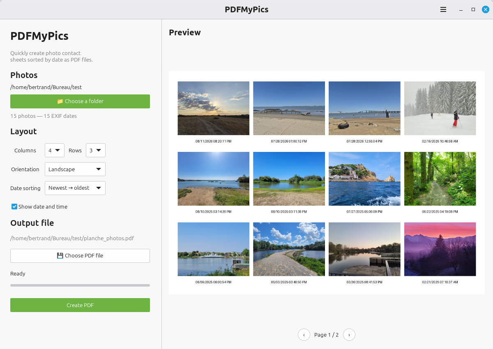

# PDFMyPics

Quickly create PDF photo contact sheets from a source folder.

PDFMyPics is a lightweight desktop application built with Python and GTK4. It lets you select a folder containing photos, arrange them into a configurable grid, preview the result, and export the photos as a PDF document.



## Features

* Create PDF contact sheets from JPG and JPEG photos
* Automatically detect and use EXIF photo dates
* Sort photos by date, ascending or descending
* Keep photos without EXIF dates at the end of the list
* Configurable number of rows and columns
* Optional photo dates displayed below each image
* Portrait and landscape page orientations
* Preview the generated pages before creating the PDF
* Progress indicator during PDF generation
* French and English translations
* Automatic language detection from the system locale
* Locale-aware date and time formatting
* Simple GTK4 graphical interface

## Requirements

PDFMyPics requires:

* Python 3.12 or newer
* GTK4
* PyGObject
* Pillow
* ReportLab

On Ubuntu/Debian, the required system packages can be installed with:

```bash
sudo apt install python3 python3-gi gir1.2-gtk-4.0
```

The Python dependencies can be installed with:

```bash
pip install Pillow reportlab
```

## Running the application

Clone the repository:

```bash
git clone https://github.com/MedShake/PDFMyPics.git
cd PDFMyPics
```

Then run:

```bash
python3 main.py
```

## Usage

1. Launch PDFMyPics.
2. Select the folder containing your photos.
3. Choose the desired page orientation.
4. Select the number of rows and columns.
5. Choose the photo sorting order.
6. Optionally enable photo dates.
7. Preview the result.
8. Choose the output location and create the PDF.

Photos are read from the selected folder and sorted using their EXIF date when available.

## Internationalization

PDFMyPics currently supports:

* 🇫🇷 French
* 🇬🇧 English

The application automatically detects the system language.

Translations are handled using GNU gettext. Translation files are located in:

```text
locale/
├── en/
│   └── LC_MESSAGES/
├── fr/
│   └── LC_MESSAGES/
└── pdfmypics.pot
```

## Project structure

```text
PDFMyPics/
├── main.py
├── pdfmypics/
│   ├── __init__.py
│   ├── app.py
│   ├── interface.py
│   ├── photos.py
│   ├── pdf.py
│   └── i18n.py
├── locale/
├── resources/
├── tests/
├── .gitignore
├── LICENSE
├── pyproject.toml
└── readme.md
```

## License

PDFMyPics is free software distributed under the terms of the GNU General Public License version 3 or later (GPL-3.0-or-later).

See the [LICENSE](LICENSE) file for details.

## Status

PDFMyPics is currently under development.

Contributions, bug reports, and suggestions are welcome.
